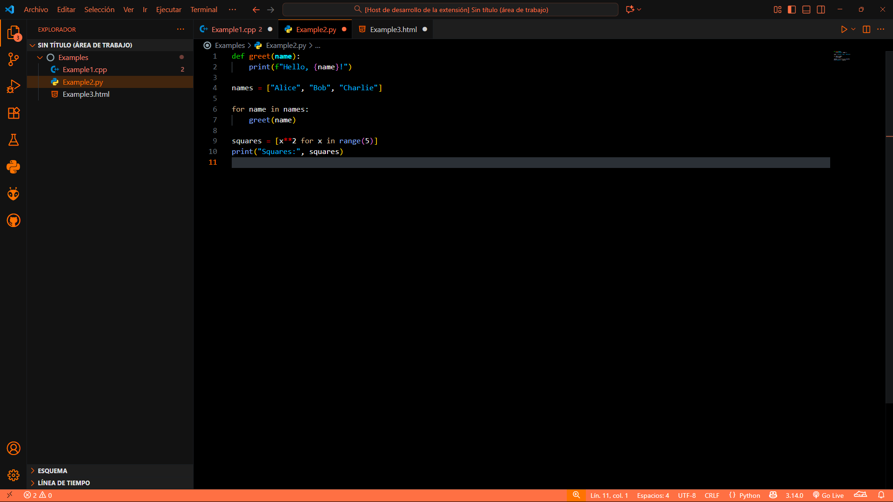
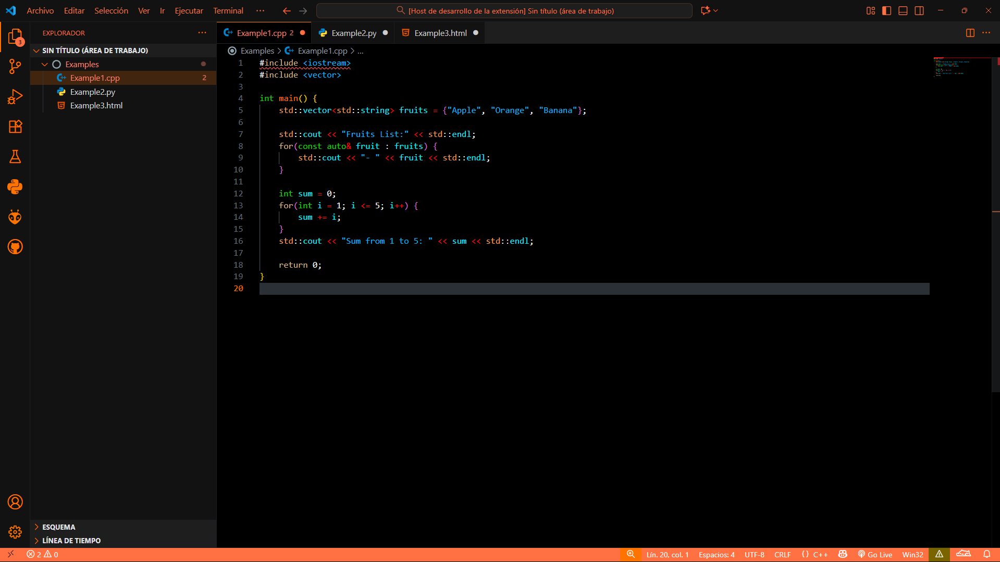
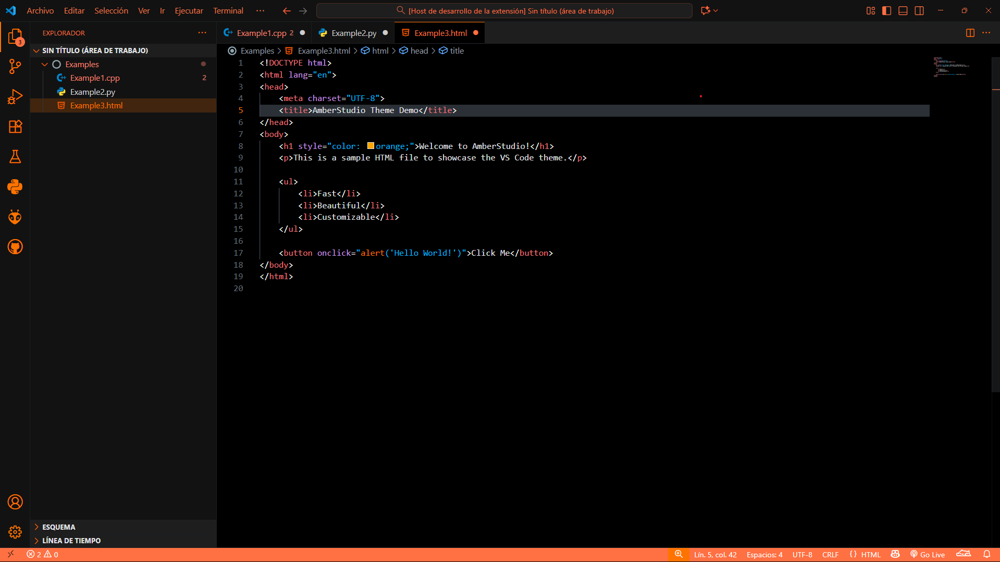

# AmberStudio

**AmberStudio** is a modern dark theme for **Visual Studio Code** featuring a bold **orange and black** base, complemented with multiple vibrant accent colors. Now, AmberStudio includes **6 new themes**: Amber Brown, Green, Purple, Red, White, Yellow, and Blue. Designed for developers who want a visually striking and comfortable coding environment.

**Author:** HantigoZore  
**Version:** 1.1.0

---

## 🎨 Screenshots

### Python Code

### C++ Code

### HTML/CSS Code

> AmberStudio highlights syntax and UI elements to provide clarity and focus while coding.

---

## ⚡ Features

- Dark theme with **bold orange and black primary palette**.  
- **6 new accent themes**: Amber Brown, Green, Purple, Red, White, Yellow, Blue.  
- Vibrant accent colors for better **syntax readability**.  
- Supports popular languages: Python, JavaScript, C/C++, HTML, CSS, PHP, Java, Rust, and more.  
- Improves visibility of **comments, strings, functions, variables, and operators**.  
- Designed for a **comfortable and modern coding experience**.  
- Lightweight and fast, no performance impact.

---

## 💻 Installation

### Quick Install via Marketplace

1. Open VS Code.  
2. Go to **Extensions** (`Ctrl+Shift+X` / `Cmd+Shift+X` on Mac).  
3. Search for **"AmberStudio"**.  
4. Click **Install** and activate via **Preferences → Color Theme → AmberStudio**.

---

## 🔧 How to Use

1. Open **Preferences → Color Theme**.  
2. Select your preferred AmberStudio theme: Amber Brown, Green, Purple, Red, White, Yellow, or Blue.  
3. Enjoy the bold colors with enhanced syntax highlights.

---

## 💡 Tips & Recommendations

- Pair with **Material Icon Theme** for a cohesive interface.  
- Optimized for **dark mode** but works well on light backgrounds.  
- Recommended fonts: **Fira Code, JetBrains Mono, Consolas** for best readability.  
- Explore different accent colors in settings to match your workflow.

---

## 📌 Acknowledgements

- Inspired by the [Github dark theme](https://github.com/primer/github-vscode-theme).  
- Activity bar icons inspired by [Material Product Icons](https://marketplace.visualstudio.com/items?itemName=PKief.material-product-icons).  
- Folder and file icons inspired by [Material Icon Theme](https://marketplace.visualstudio.com/items?itemName=PKief.material-icon-theme).  
- Visual elements and accent colors designed by **HantigoZore**.

---

## 🌟 Contributing

We welcome contributions! Help improve AmberStudio:

1. Fork the repository.  
2. Create a new branch (`git checkout -b feature/your-feature`).  
3. Make changes and submit a **pull request**.  

> Suggestions, bug reports, and enhancements are always appreciated.

---

## 📄 License

This project is licensed under the **MIT License**.  
You are free to use, modify, and share it while keeping credits to the author.
