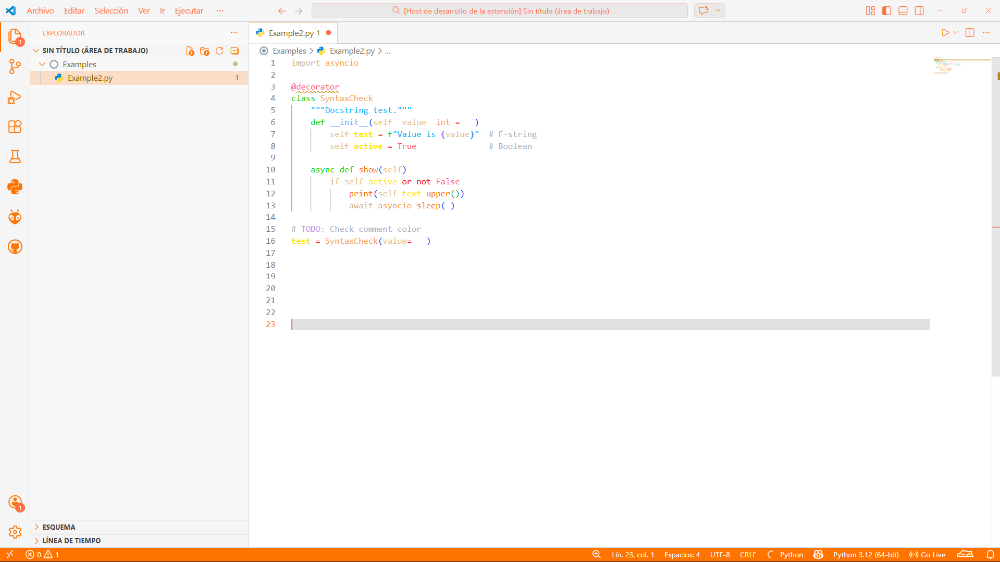
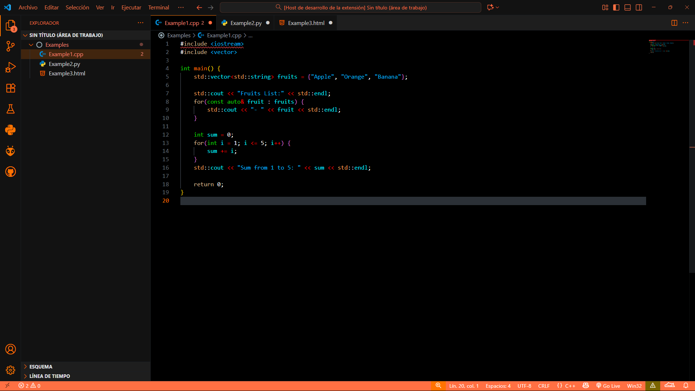
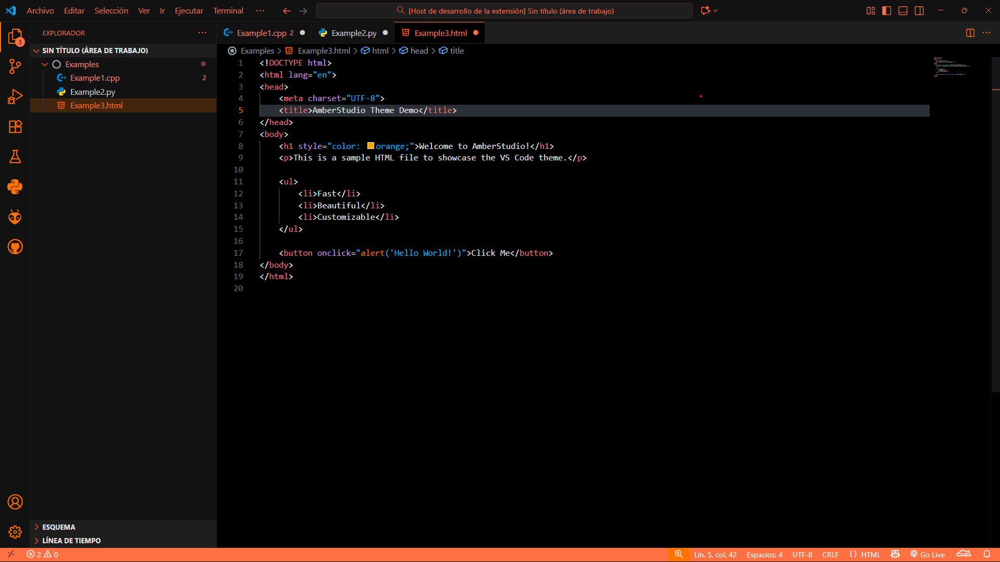

# AmberStudio


**AmberStudio** is a modern theme collection for **Visual Studio Code** featuring a bold **orange and black** design with multiple vibrant accent colors.

The theme pack now includes both **dark and light variants**, allowing developers to switch between comfortable dark environments and clean light interfaces while keeping the same visual identity.

**Author:** HantigoZore
**Version:** 1.2.0

---

# 🎨 Screenshots

### Python Code



### C++ Code



### HTML/CSS Code



> AmberStudio highlights syntax and UI elements to provide clarity and focus while coding.

---

# ⚡ Features

* Bold **orange and black base palette** designed for long coding sessions.
* Multiple **accent color variations**.
* **Dark and light theme variants**.
* Light themes follow the format **`Amber-Color-White`**.
* New **Amber-IkarOS** theme inspired by the **IkarOS OS project**.
* Improved readability for:

  * comments
  * strings
  * functions
  * variables
  * operators
* Supports many programming languages:
  **Python, JavaScript, C/C++, HTML, CSS, PHP, Java, Rust, and more.**
* Lightweight and optimized for performance.

---

# 🎨 Available Themes

## Dark Themes

* Amber Brown
* Amber Green
* Amber Purple
* Amber Red
* Amber White
* Amber Yellow
* Amber Blue
* **Amber IkarOS**

## Light Themes

Light versions of the main themes are included:

* Amber Brown White
* Amber Green White
* Amber Purple White
* Amber Red White
* Amber White White
* Amber Yellow White
* Amber Blue White
* **Amber IkarOS White**

> Light themes maintain the same accent colors while adapting the UI for bright environments.

---

# 🔄 Recent Changes

### Version 1.2.0

* Added **light versions** of the existing themes.
* Added **Amber-IkarOS** theme.
* Added **Amber-IkarOS-White** theme.
* Renamed **Fiery theme → IkarOS** to align with the **IkarOS OS project**.

---

# 💻 Installation

## Quick Install via Marketplace

1. Open **VS Code**.
2. Go to **Extensions** (`Ctrl + Shift + X`).
3. Search for **AmberStudio**.
4. Click **Install**.
5. Activate it via **Preferences → Color Theme**.

---

# 🔧 How to Use

1. Open **Preferences → Color Theme**.
2. Select your preferred AmberStudio theme.
3. Choose between **Dark** or **White** versions depending on your environment.

---

# 💡 Tips & Recommendations

* Pair with **Material Icon Theme** for a cohesive interface.
* Recommended fonts:

  * **Fira Code**
  * **JetBrains Mono**
  * **Consolas**
* Works great with **transparent terminals and modern VS Code setups**.

---

# 📌 Acknowledgements

* Inspired by the **GitHub Dark Theme**
* Icons inspired by **Material Product Icons**
* File icons inspired by **Material Icon Theme**
* Visual design and accents created by **HantigoZore**

---

# 🌟 Contributing

Contributions are welcome.

1. Fork the repository.
2. Create a branch:

```
git checkout -b feature/your-feature
```

3. Commit your changes.
4. Submit a **Pull Request**.

Bug reports, suggestions, and improvements are always appreciated.

---

# 📄 License

This project is licensed under the **MIT License**.

You are free to **use, modify, and distribute** the project while keeping proper credit to the author.

---
